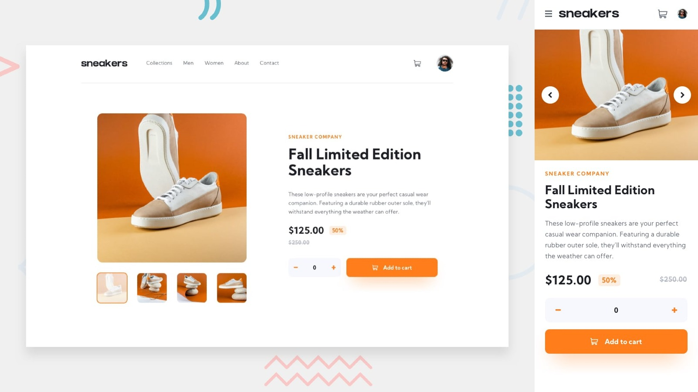

# Frontend Mentor - E-commerce product page solution

This is my solution to the [E-commerce product page challenge on Frontend Mentor](https://www.frontendmentor.io/challenges/ecommerce-product-page-UPsZ9MJp6)

## The challenge

Users should be able to:

- View the optimal layout for the site depending on their device's screen size
- See hover states for all interactive elements on the page
- Open a lightbox gallery by clicking on the large product image
- Switch the large product image by clicking on the small thumbnail images
- Add items to the cart
- View the cart and remove items from it

## Links

- [Solution URL](https://www.frontendmentor.io/challenges/ecommerce-product-page-UPsZ9MJp6)
- [Live Site URL](https://jhon-okayda-e-commerce-product-page.netlify.app/)

## Built with

- Mobile-first (Layout)
- React-JS
- Swiper-JS
- SASS/SCSS Modules
- BEM Methodology

## Author

- Created by - okayda-jhon
